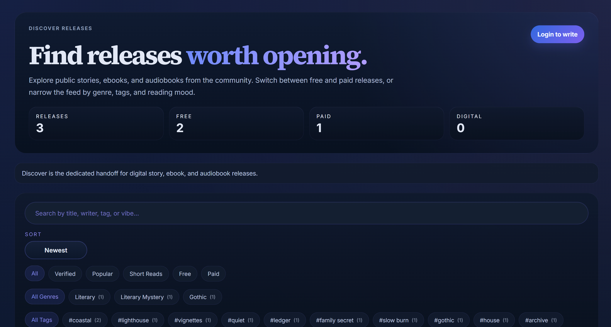

<h1 align="center">Shanmukha Avinash Boni</h1>

  <b>Data Science &amp; AI</b> — I build intelligent systems end to end, from embeddings and ML pipelines to the products they ship inside.

  
  
  

---

M.S. in **Data Science &amp; Artificial Intelligence** (4.0 GPA, University of Central Missouri). Previously an Associate Systems Engineer at **Tata Consultancy Services**, building SharePoint and Power Apps solutions for enterprise clients.

Most interested in the space where **machine learning meets real products** — recommendation engines, voice interfaces, and LLM-powered tooling people actually use.

🔭 Building **Shalvera** &amp; **JobShelf** &nbsp;·&nbsp; 🌱 Foundation models &amp; explainable AI &nbsp;·&nbsp; 💬 Ask me about embeddings, Whisper, or shipping solo

---

## 📚 Shalvera — reading, writing &amp; marketplace platform

A full-stack platform designed and built solo:

- **Semantic recommendation engine** — MiniLM sentence embeddings with genre/tag boosting, powering "Similar books" and purchase-driven personalization rails
- **Shalvy, a voice-first AI assistant** — opt-in wake-word activation, push-to-talk, Whisper dictation (replacing Web Speech for accuracy), gated LLM/TTS tier
- **Multi-seller marketplace** — seller-grouped checkout with atomic all-or-none rollback, row-level oversell locking, post-purchase tracking &amp; disputes
- Real-time messaging (Redis + SSE), moderation with audit trail, Google OAuth (JWKS), full PHP → containerized monorepo migration

**[→ Explore the repo](https://github.com/Shannu1922/shalvera)**

---

## 🗂️ JobShelf — AI-powered job-search platform

- Aggregates live roles **direct from employer ATS APIs** (Greenhouse, Lever) plus Adzuna — no third-party redirects
- **Scores &amp; ranks** every posting against your profile: seniority, employment type, location, sponsorship
- **LLM integration** — tailored cover letters from reusable templates, and an assistant that knows your whole search
- **Email-driven tracking** — classifies application mail via the Gmail API and updates your funnel automatically
- Multi-user auth (Argon2id, per-user data isolation, rate-limiting) · **150+ tests**

**[→ Explore the repo](https://github.com/Shannu1922/jobshelf-showcase)**

---

## 💳 Credit Card Fraud Detection

End-to-end ML on a severely imbalanced dataset (284K transactions, 0.17% fraud). SMOTE resampling, comparing Logistic Regression, Random Forest and XGBoost — evaluated on **precision/recall and PR-AUC**, not accuracy.

**[→ Explore the repo](https://github.com/Shannu1922/credit-card-fraud-detection)**

---

## 🧠 Foundation Models &amp; Explainable AI — graduate research

Analysis of foundation models (BERT, GPT, CLIP) and the **VIS4FM / FM4VIS** frameworks for interpretability and bias detection, synthesizing 100+ references into a roadmap for pairing explainable AI with interactive visualization.

---

## 🛠️ Tech

**Languages** Python · SQL · TypeScript · JavaScript · PHP · Java · C

**ML &amp; Data** pandas · NumPy · scikit-learn · XGBoost · sentence embeddings · Whisper · BERT / GPT / CLIP · explainable AI

**Backend** FastAPI · Flask · PostgreSQL · Redis · REST APIs · OAuth

**Frontend &amp; Infra** Next.js · React · Docker · AWS S3 · Stripe · Git

---

<i>Open to Data Scientist / AI-ML Engineer roles.</i>

<h1 align="center">Shanmukha Avinash Boni</h1>

  <b>Data Science &amp; AI</b> — I build intelligent systems end to end, from embeddings and ML pipelines to the products they ship inside.

  
  
  

---

M.S. in **Data Science &amp; Artificial Intelligence** (4.0 GPA, University of Central Missouri). Previously an Associate Systems Engineer at **Tata Consultancy Services**, building SharePoint and Power Apps solutions for enterprise clients.

Most interested in the space where **machine learning meets real products** — recommendation engines, voice interfaces, and LLM-powered tooling people actually use.

🔭 Building **Shalvera** &amp; **JobShelf** &nbsp;·&nbsp; 🌱 Foundation models &amp; explainable AI &nbsp;·&nbsp; 💬 Ask me about embeddings, Whisper, or shipping solo

---

## 📚 Shalvera — reading, writing &amp; marketplace platform

A full-stack platform designed and built solo:

- **Semantic recommendation engine** — MiniLM sentence embeddings with genre/tag boosting, powering "Similar books" and purchase-driven personalization rails
- **Shalvy, a voice-first AI assistant** — opt-in wake-word activation, push-to-talk, Whisper dictation (replacing Web Speech for accuracy), gated LLM/TTS tier
- **Multi-seller marketplace** — seller-grouped checkout with atomic all-or-none rollback, row-level oversell locking, post-purchase tracking &amp; disputes
- Real-time messaging (Redis + SSE), moderation with audit trail, Google OAuth (JWKS), full PHP → containerized monorepo migration

**[→ Explore the repo](https://github.com/Shannu1922/shalvera)**

---

## 🗂️ JobShelf — AI-powered job-search platform

- Aggregates live roles **direct from employer ATS APIs** (Greenhouse, Lever) plus Adzuna — no third-party redirects
- **Scores &amp; ranks** every posting against your profile: seniority, employment type, location, sponsorship
- **LLM integration** — tailored cover letters from reusable templates, and an assistant that knows your whole search
- **Email-driven tracking** — classifies application mail via the Gmail API and updates your funnel automatically
- Multi-user auth (Argon2id, per-user data isolation, rate-limiting) · **150+ tests**

**[→ Explore the repo](https://github.com/Shannu1922/jobshelf)**

---

## 💳 Credit Card Fraud Detection

End-to-end ML on a severely imbalanced dataset (284K transactions, 0.17% fraud). SMOTE resampling, comparing Logistic Regression, Random Forest and XGBoost — evaluated on **precision/recall and PR-AUC**, not accuracy.

**[→ Explore the repo](https://github.com/Shannu1922/credit-card-fraud-detection)**

---

## 🧠 Foundation Models &amp; Explainable AI — graduate research

Analysis of foundation models (BERT, GPT, CLIP) and the **VIS4FM / FM4VIS** frameworks for interpretability and bias detection, synthesizing 100+ references into a roadmap for pairing explainable AI with interactive visualization.

---

## 🛠️ Tech

**Languages** Python · SQL · TypeScript · JavaScript · PHP · Java · C

**ML &amp; Data** pandas · NumPy · scikit-learn · XGBoost · sentence embeddings · Whisper · BERT / GPT / CLIP · explainable AI

**Backend** FastAPI · Flask · PostgreSQL · Redis · REST APIs · OAuth

**Frontend &amp; Infra** Next.js · React · Docker · AWS S3 · Stripe · Git

---

<i>Open to Data Scientist / AI-ML Engineer roles.</i>

